  

---

## `> who_am_i`

- AI/ML student
- Building a multi-agent orchestration platform: a central orchestrator splits tasks into a DAG and routes them to specialized agents
- Currently learning transformers, RAG and LangGraph
- Long-term goal: research on multi-agent LLM systems

---

## `> arsenal`

  

Dashed outlines = still learning.

---

## `> featured_project`

### ResQ AI: Disaster Intelligence System

Turns messy, unstructured disaster reports into a prioritized, map-based picture of what needs attention first.

| Stage | What it does |
|---|---|
| **Extract** | Pulls disaster type, location and severity out of raw report text |
| **Cluster** | Groups duplicate reports using semantic similarity |
| **Rank** | Prioritizes incidents as critical / high / moderate |
| **Visualize** | Live React map with one pin per area; click a pin to see its issues by priority |
| **Summarize** | LLM-generated incident summaries |

**Stack:** `Python` · `scikit-learn` · `NLP` · `Flask` · `React` · `MongoDB`

*Hackathon prototype · repository coming soon*

---

  <code>// end of transmission</code>

