  

Dashed outlines = still learning.

### ResQ AI: Disaster Intelligence System

Turns messy, unstructured disaster reports into a prioritized, map-based picture of what needs attention first.

**Stack:** `Python` · `scikit-learn` · `NLP` · `Flask` · `React` · `MongoDB`

*Hackathon prototype · repository coming soon*

